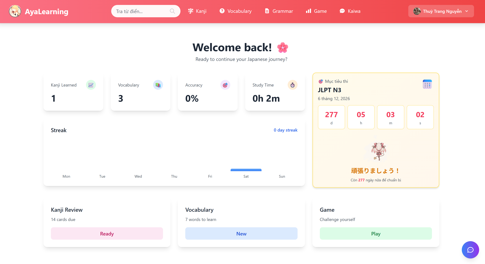
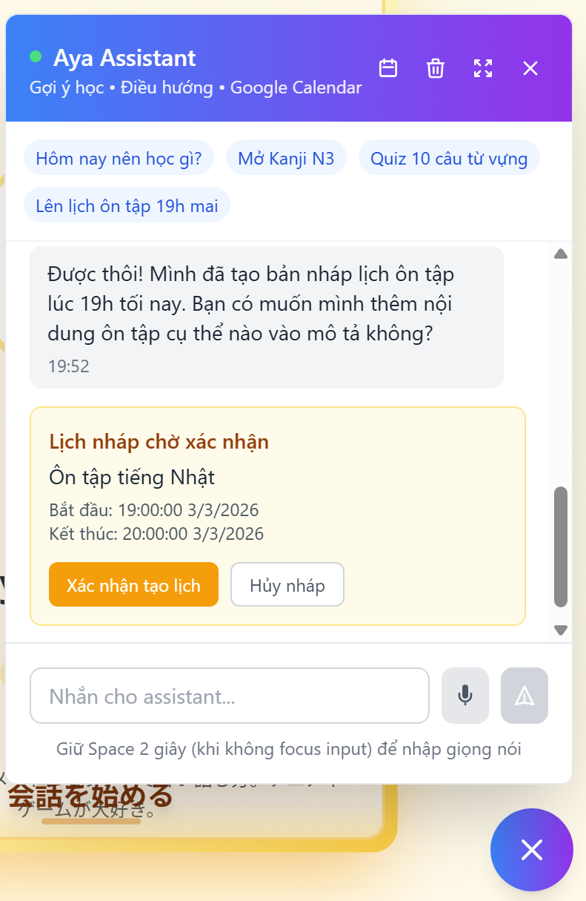
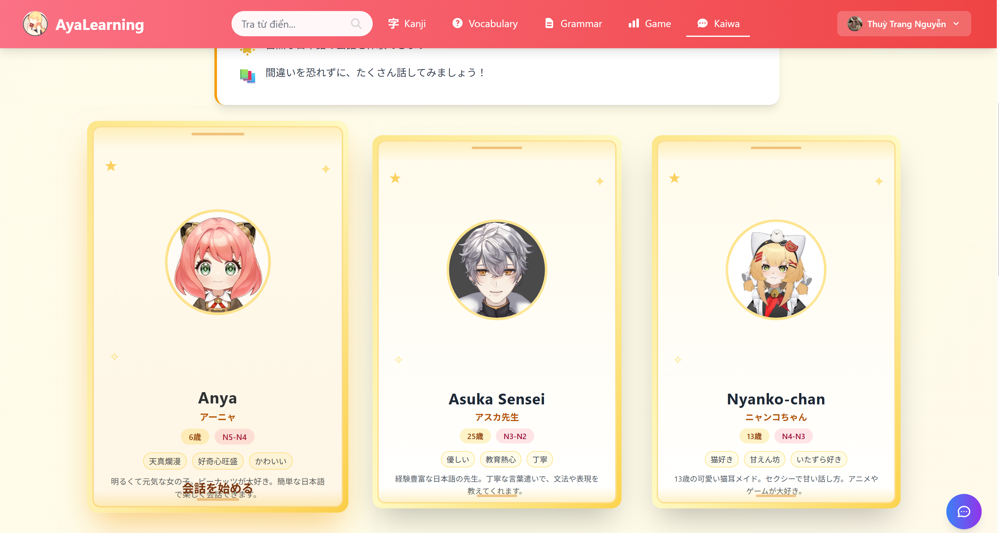
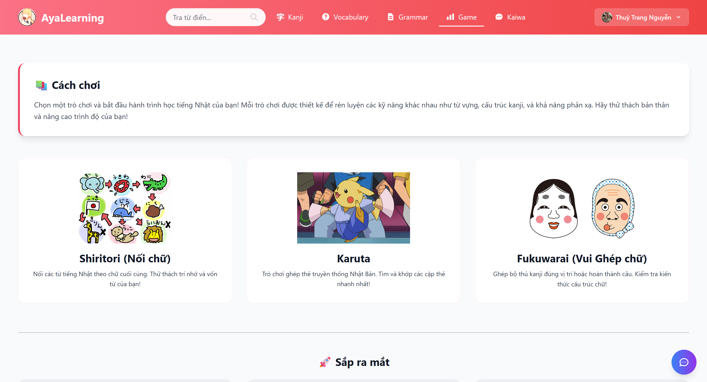

# AyaLearning

My personal Japanese learning space (Kanji, Vocabulary, Quiz, Kaiwa voice chat).



## Features

- Kanji & Vocabulary management (add/edit/delete/search/pagination)

- Multiple quiz experiences for self-practice and quick review
- AI assistant agent for in-app guidance, quick navigation, and study support

- Kaiwa with character personas (Anya, Asuka Sensei, Nyanko) using Live2D avatar playback + audio-driven lip-sync + real-time voice mode: ASR (Faster-Whisper) → LLM reply → TTS (VOICEVOX)  

- Japanese learning mini-games: Shiritori, Karuta, and Fukuwarai (updating)


## Tech Stack

- Frontend: React, React Hooks, Tailwind CSS
- Backend: Node.js, Express, REST API
- Authentication: Google OAuth 2.0 + JWT
- Database: PostgreSQL
- AI/LLM: Gemini (primary), OpenRouter-compatible integration
- ASR: Faster-Whisper (local FastAPI service in `asr-service`)
- TTS: VOICEVOX Engine (per-character voice mapping)
- Real-time Avatar: Live2D model rendering + lip-sync playback
- DevOps/Runtime: Docker, Docker Compose

## Quick Start

### Prerequisites

- Node.js 18+
- npm
- Docker Desktop (or Docker Engine + Compose)

### 1) Install dependencies

At workspace root:

```bash
npm install
npm install --prefix backend
npm install --prefix frontend
```

### 2) Configure backend env

Edit `backend/.env` (minimum required for voice mode):

```bash
GEMINI_API_KEY=your_key
GEMINI_MODEL=gemini-2.5-flash

TTS_PROVIDER=voicevox
VOICEVOX_API_URL=http://127.0.0.1:50021
VOICEVOX_SPEAKER=54

OPENAI_ASR_ENDPOINT=http://localhost:9000/v1/audio/transcriptions
OPENAI_ASR_MODEL=small
```

> `VOICEVOX_SPEAKER` is fallback only. Per-character speaker is configured in `backend/config/kaiwa-characters.json`.

### 2.1) Configure frontend env

Create `frontend/.env`:

```bash
REACT_APP_BACKEND_URL=http://localhost:3001
REACT_APP_GOOGLE_CLIENT_ID=your_google_oauth_web_client_id
```

For production, set `REACT_APP_BACKEND_URL` to your public backend domain (Render/other), for example:

```bash
REACT_APP_BACKEND_URL=https://your-backend.onrender.com
```

### 3) Start infrastructure services (DB + ASR + VOICEVOX)

One command from workspace root:

```bash
npm run services:up
```

Equivalent Docker command:

```bash
docker compose up -d db asr voicevox
```

### 4) Start app (frontend + backend)

```bash
npm run start-dev
```

- Frontend: `http://localhost:3000`
- Backend: `http://localhost:3001`

## Deploy (Vercel + Render)

### Recommended architecture

- Frontend: Vercel (Root Directory: `frontend`)
- Backend: Render Web Service (Root Directory: `backend`)
- Database: Render PostgreSQL

### Backend (Render)

- Build Command: `npm install`
- Start Command: `npm start`
- Required envs: `PORT`, `DB_HOST`, `DB_PORT`, `DB_NAME`, `DB_USER`, `DB_PASSWORD`, `JWT_SECRET`, `GOOGLE_CLIENT_ID`, `GOOGLE_CLIENT_SECRET`, `FRONTEND_URL`
- Run schema once: `node runSqlFile.js schema.base.sql`

### Frontend (Vercel)

- Root Directory: `frontend`
- Build Command: `npm run build`
- Output Directory: `build`
- Env: `REACT_APP_BACKEND_URL=https://<your-render-backend-domain>`
- Env: `REACT_APP_GOOGLE_CLIENT_ID=<your-google-client-id>`

## Kaiwa Voice Mode

### Character voice mapping (VOICEVOX)

Current mapping in `backend/config/kaiwa-characters.json`:

- `anya` → 春歌ナナ (`voicevoxSpeaker: 54`)
- `sensei` → 黒沢冴白 (`voicevoxSpeaker: 100`)
- `yuki` → ユーレイちゃん (`voicevoxSpeaker: 102`)

### Voice APIs

- `POST /api/kaiwa/voice-turn`
  - Request: `character`, `conversationHistory`, `audioBase64`, `mimeType`
  - Response: `transcript`, `reply`, `audioUrl`, `visemes`, `timestamp`
- `GET /api/kaiwa/voice-status`
  - Returns ASR/TTS provider status and readiness

## Database Schema

- `backend/schema.sql`: development reset schema (destructive)
- `backend/schema.base.sql`: production-safe base schema (non-destructive)

From `backend/`:

```bash
npm run db:schema:dev
npm run db:schema:prod
```

## Useful Scripts

From workspace root:

- `npm run services:up` → start `db`, `asr`, `voicevox`
- `npm run services:down` → stop `db`, `asr`, `voicevox`
- `npm run start-dev` → start frontend + backend

## Troubleshooting

### `npm run services:up` exits with code 1

Check Docker first:

```bash
docker compose config
docker compose ps
docker compose logs asr
docker compose logs voicevox
```

If port conflict:

- `5433` (Postgres)
- `9000` (ASR)
- `50021` (VOICEVOX)

### VOICEVOX speaker check

```bash
curl http://localhost:50021/speakers
```

### Voice status check

```bash
curl http://localhost:3001/api/kaiwa/voice-status
```

## Project Structure (high-level)

- `frontend/`: React UI
- `backend/`: API + Kaiwa orchestration + DB logic
- `asr-service/`: Faster-Whisper transcription service
- `docker-compose.yml`: local infra services

